## Owezy Firebase Setup

This repo is now wired for:
- Expo mobile/web frontend
- Firebase Cloud Functions backend (`functions/`)
- Firestore persistence in Firebase runtime
- SQLite persistence for local non-Firebase runtime

## App Screens

The screenshots below are ordered to match the main app flow from onboarding through split completion and the tab views.

### 1. Onboarding

Landing screen that introduces Owezy and highlights the core promise: split receipts in seconds.

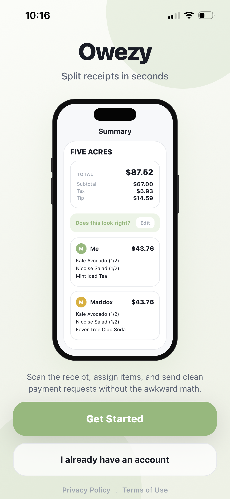

### 2. Home

The main dashboard where users can scan a receipt, upload a photo, or start a manual entry.

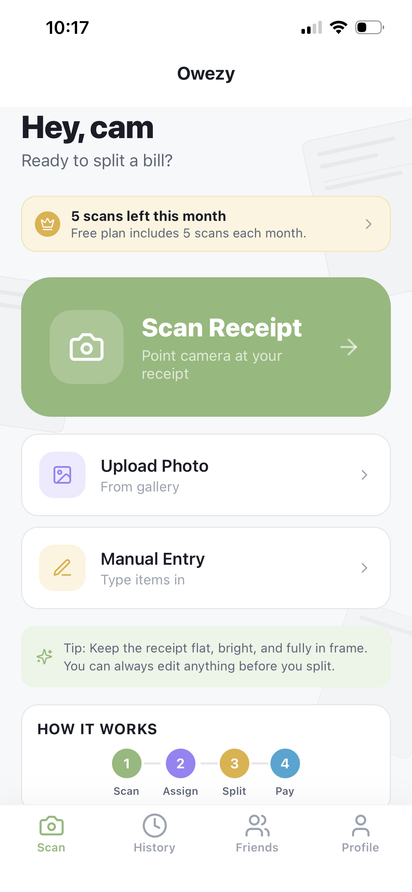

### 3. Who's Splitting

The people picker where users choose who is part of the current bill before assigning items.

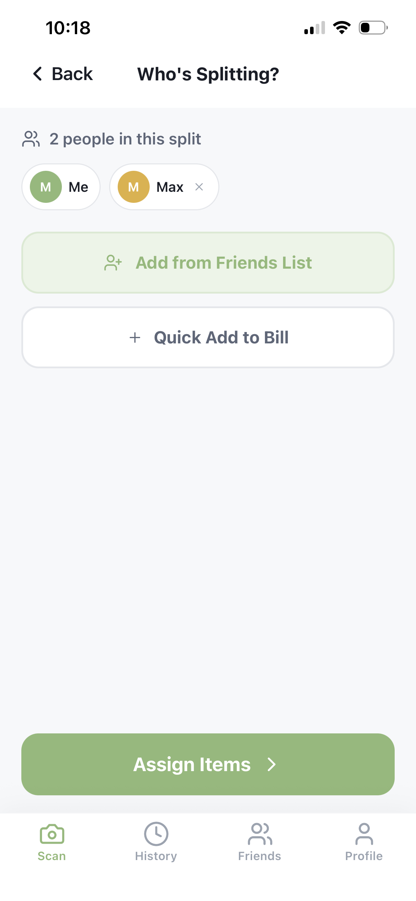

### 4. Edit Items

The item editor where scanned line items can be reviewed, adjusted, deleted, or added before splitting.

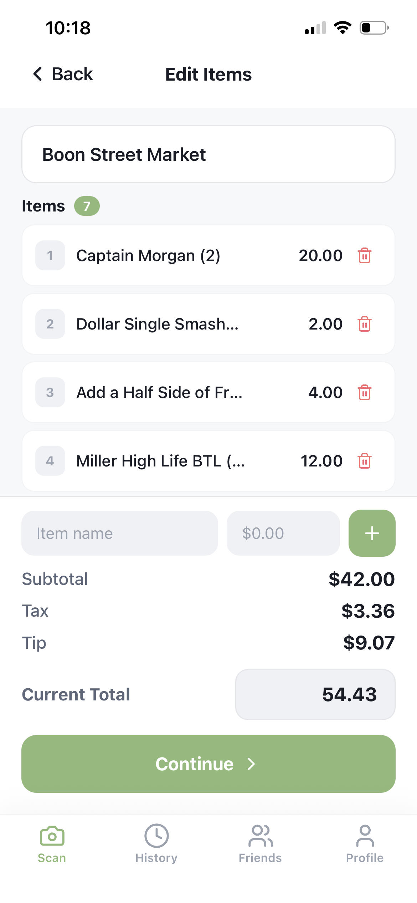

### 5. Tip

The tip screen where Owezy shows the detected tip and lets users split it by items or evenly.

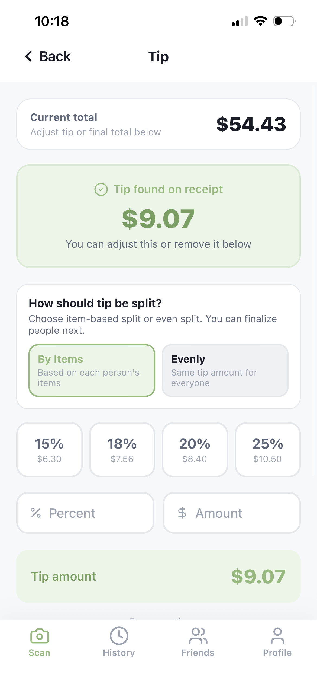

### 6. Assign Items

The assignment screen where each line item is split across the selected people.

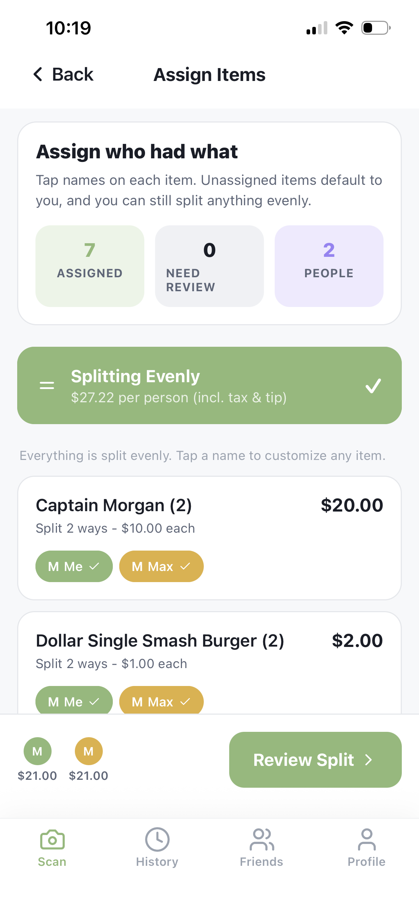

### 7. Summary

The final split summary showing the total, tax, tip, and each person’s itemized share.

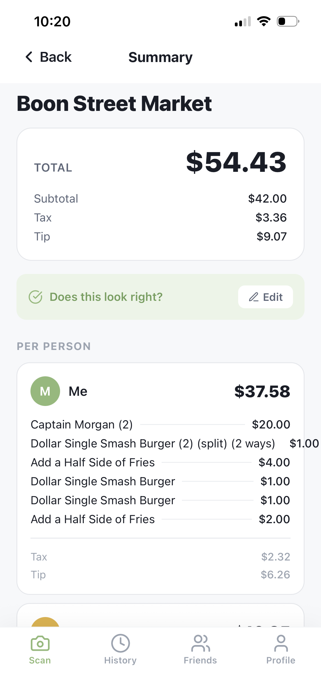

### 8. Payment

The payment request screen where users can send payment requests, share details, or mark someone as paid.

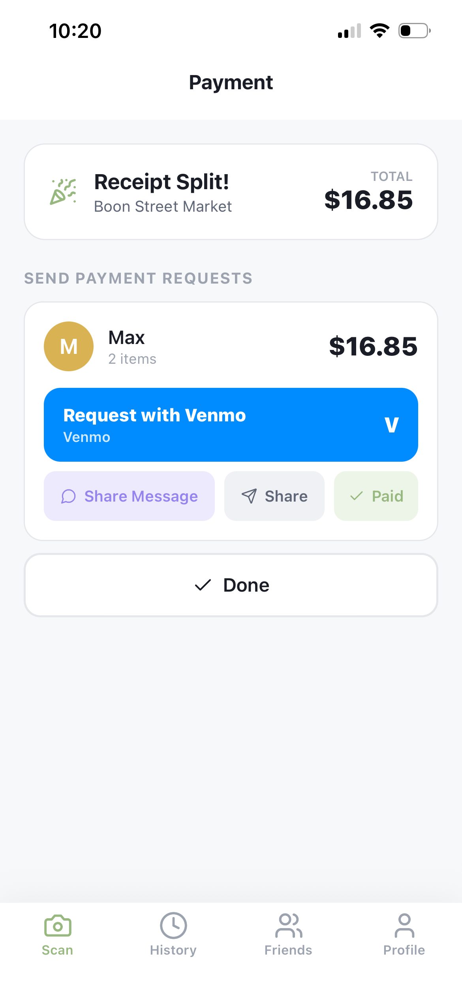

### 9. History

The receipt history view where past splits can be searched, filtered, and reviewed by payment state.

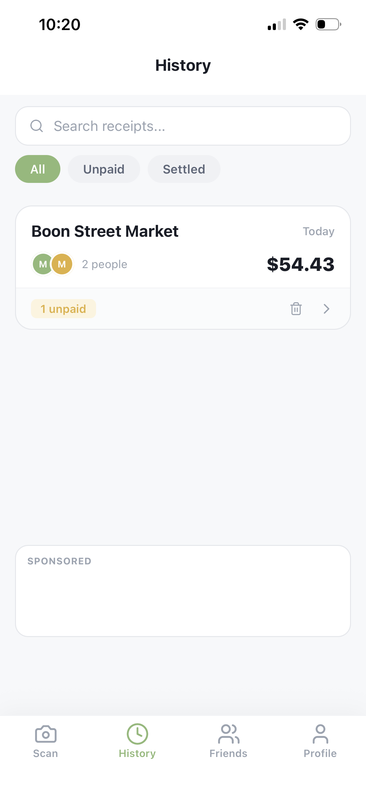

### 10. Friends

The friends tab where users can manage saved split contacts and send friend requests.

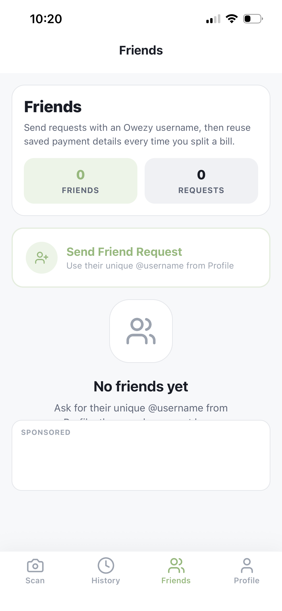

### 11. Profile

The account profile screen showing scan totals, split totals, subscription status, and profile settings.

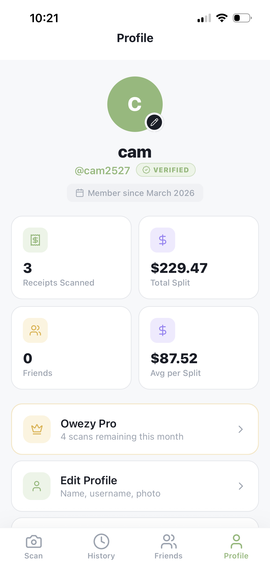

## Changes In Progress

The following UI and data issues are currently being worked on and are intentionally noted here for visibility:

- Greyed-out bubble bleeds into the camera view slightly.
- The receipts scanned total does not update correctly after deleting receipts from History.

### 1. Prerequisites

Install Firebase CLI:

```bash
npm install -g firebase-tools
```

Log in:

```bash
firebase login
```

### 2. Install Dependencies

From repo root:

```bash
npm install
npm --prefix functions install
```

### 3. Confirm Firebase Project

Select the Firebase project you want this app to use:

```bash
firebase projects:list
firebase use <your-project-id>
```

### 4. Deploy Firestore Rules + Backend Function

Deploy:

```bash
firebase deploy --only firestore,functions
```

Function name is `backend`, so your API base URL is:

```text
https://us-central1-<your-project-id>.cloudfunctions.net/backend
```

### 5. Point Expo App to Firebase Backend

Create `.env` in repo root:

```env
EXPO_PUBLIC_API_BASE_URL=https://us-central1-<your-project-id>.cloudfunctions.net/backend
```

Then start app:

```bash
npm run start-local
```

### 6. Local Emulator (Optional)

Run emulator:

```bash
firebase emulators:start --only functions,firestore
```

For local API testing, set:

```env
EXPO_PUBLIC_API_BASE_URL=http://127.0.0.1:5001/<your-project-id>/us-central1/backend
```

### 7. What Changed in Code

- Firebase config files added:
  - `firebase.json`
  - `firestore.rules`
  - `firestore.indexes.json`
- Cloud Functions backend added:
  - `functions/src/index.ts`
  - `functions/package.json`
  - `functions/tsconfig.json`
- Store now auto-selects persistence backend:
  - Firestore in Firebase runtime
  - SQLite locally
  - File: `backend/store.ts`
- tRPC routes/context updated to await async store operations.

### 8. Notes

- `OWEZY_STORE_MODE` defaults to `auto`:
  - Firebase runtime -> Firestore
  - Local runtime -> SQLite
- You can override:
  - `OWEZY_STORE_MODE=firebase`
  - `OWEZY_STORE_MODE=sqlite-file`
  - `OWEZY_STORE_MODE=memory`

### 9. OCR Provider Setup (Optional, Recommended)

The app now supports two OCR paths:
- Primary (if configured): Google Document AI Expense parser
- Fallback: Google Cloud Vision OCR parser

OCR routing modes:
- `docai_first` (default): best quality consistency, highest OCR cost.
- `vision_first_guarded`: Vision-first with quality gate; escalates to DocAI only when Vision confidence is weak. This is typically much cheaper while preserving quality on clean receipts.

To enable higher-accuracy receipt parsing with Document AI:
1. In Google Cloud Console, enable `documentai.googleapis.com`.
2. Create an Expense parser processor (location `us` is typical).
3. In Firebase Console -> Functions -> `backend` -> Edit -> Runtime environment variables, set:
- `DOCAI_PROCESSOR_ID=<YOUR_PROCESSOR_ID>`
- `DOCAI_LOCATION=us`
4. Deploy functions again.

If not configured, OCR will still run using Vision fallback.

Optional OCR runtime variables:

```env
OWEZY_OCR_ROUTING_MODE=vision_first_guarded
# supported modes: vision_only, vision_first_guarded, docai_first
# for vision_first_guarded:
OWEZY_VISION_FIRST_MAX_SCORE=0.08
OWEZY_VISION_FIRST_MIN_ITEM_COUNT=2
```

iOS on-device OCR (Apple Vision) can be used before cloud OCR:
- Client attempts on-device text extraction first (when enabled and native module exists).
- App sends extracted text to `scans.parseReceiptText` for receipt parsing.
- If parsing fails with `NO_ITEMS_OR_TOTAL`, app falls back to cloud image OCR.
- A local Expo native module is included at `modules/apple-vision-ocr` and registers `AppleVisionOCR`.

Client toggles:

```env
EXPO_PUBLIC_IOS_ON_DEVICE_OCR_ENABLED=1
EXPO_PUBLIC_IOS_ON_DEVICE_OCR_FALLBACK_ONLY_ON_NO_ITEMS=1
```

Native module contract expected by app:
- `NativeModules.AppleVisionOCR.recognizeText(imageUri: string)`
- Return shape: `string` or `string[]` or `{ text?: string; lines?: string[] }`

To test end-to-end on iOS on macOS:

```bash
npm run ios:prebuild
npm run ios:run
```

Notes:
- Use a development build (Expo Go cannot load this custom native module).
- On macOS, the simulator path validates the full on-device OCR -> `scans.parseReceiptText` flow.
- On Windows, use an EAS iOS development build for real-device testing instead of `expo run:ios`.

### 10. Apple Developer + EAS iOS Setup

With an Apple Developer membership, you can now test the Apple Vision OCR module on a real iPhone and ship signed iOS builds.

Recommended first-time setup:
1. Create or confirm the iOS bundle ID you want to keep:
   - Current bundle ID in this repo: `app.owezy.receipt.splitter`
   - If you want a different final bundle ID, change `expo.ios.bundleIdentifier` in `app.json` before your first release flow.
2. Log in to Expo:

```bash
npx eas login
```

3. Initialize this repo with your Expo account:

```bash
npx eas init
```

4. Build the signed iOS development client:

```bash
npm run eas:build:ios:development
```

5. Start the Metro server for the dev client:

```bash
npm run ios:dev
```

6. Install the development build on your iPhone and test receipt scanning.

Useful notes:
- This repo now includes `expo-dev-client`, which is required for the custom native Apple Vision OCR module.
- `expo run:ios` is a macOS-only path. From Windows, use EAS cloud builds for iPhone testing.
- During the first EAS iOS build, Expo may prompt you to log into Apple and create/sign certificates and provisioning profiles.
- If you want to install internal iOS builds on specific devices before TestFlight, register devices with EAS when prompted during the build flow.

When you are ready for wider distribution:

```bash
npm run eas:build:ios:preview
npm run eas:build:ios:production
npm run eas:submit:ios
```

### 11. Monetization + Ads Setup

The app is configured for:
- Free tier scan allowance (default `5` scans/month)
- RevenueCat-based paid scan allowances (monthly + yearly Pro)
- Optional ad placements (History + Friends) for non-Pro users

For real AdMob banners in native builds, add and configure:

```bash
npx expo install react-native-google-mobile-ads
```

Client `.env` options:

```env
EXPO_PUBLIC_FREE_SCANS_PER_MONTH=5
EXPO_PUBLIC_ADS_ENABLED=1
EXPO_PUBLIC_ADMOB_IOS_APP_ID=
EXPO_PUBLIC_ADMOB_ANDROID_APP_ID=
EXPO_PUBLIC_ADMOB_HISTORY_BANNER_ID=
EXPO_PUBLIC_ADMOB_FRIENDS_BANNER_ID=
```

AdMob notes:
- `EXPO_PUBLIC_ADMOB_IOS_APP_ID` / `EXPO_PUBLIC_ADMOB_ANDROID_APP_ID` are native app IDs from AdMob App settings.
- `EXPO_PUBLIC_ADMOB_HISTORY_BANNER_ID` / `EXPO_PUBLIC_ADMOB_FRIENDS_BANNER_ID` are banner unit IDs.
- This repo now includes `app.config.ts`, which conditionally injects the Google Mobile Ads Expo plugin when the package is installed and app IDs are set.
- After installing the package or changing App IDs, create a fresh development build. Expo Go cannot load this native ads module.

Functions runtime variables (Firebase Functions -> Runtime environment variables):

```env
OWEZY_REVENUECAT_SECRET_API_KEY=rc_...
OWEZY_REVENUECAT_ENTITLEMENT_ID=pro
OWEZY_FREE_SCANS_PER_MONTH=5
OWEZY_PRO_MONTHLY_SCANS_PER_MONTH=40
OWEZY_PRO_YEARLY_SCANS_PER_MONTH=60
```

Security notes:
- `EXPO_PUBLIC_*` values are bundled into the client app. Only put client-safe identifiers there.
- Keep all server secrets, including `OWEZY_REVENUECAT_SECRET_API_KEY`, in backend runtime environment variables only.
- If a secret key was ever committed, logged, or shipped in a client build, rotate it in the provider console before redeploying.

Pricing and allowance note:
- These defaults assume iOS can often use on-device Apple Vision text extraction before cloud OCR, which lowers average OCR cost on clean receipts.
- Store prices shown in-app still come from RevenueCat/App Store products when available. If you change the included scan counts here, update the corresponding RevenueCat product metadata and App Store pricing to match.

Optional explicit RevenueCat product ID mapping:

```env
OWEZY_RC_PRODUCT_IDS_PRO_MONTHLY=owezy_pro_monthly
OWEZY_RC_PRODUCT_IDS_PRO_YEARLY=owezy_pro_annual
```

### 12. Recommended Store Product Structure

For the current scan model in this repo, keep a single Pro entitlement and two subscription products:

```text
Entitlement: pro

Subscriptions
- owezy_pro_monthly
- owezy_pro_annual

```

Recommended user-facing allowances:
- Free: `5 scans / month`
- Pro Monthly: `40 scans / month`
- Pro Annual: `60 scans / month`

### 13. RevenueCat + App Store Connect Setup

1. In App Store Connect, create your app record for bundle ID `app.owezy.receipt.splitter`.
2. In `Agreements, Tax, and Banking`, complete the paid apps agreement, bank info, and tax forms.
3. Under your app, create one subscription group named `Owezy Pro`.
4. Add these auto-renewable subscriptions inside that group:
   - `owezy_pro_monthly`
   - `owezy_pro_annual`
5. Add localization, pricing, and review screenshots for each product in App Store Connect.
6. In RevenueCat, create or open your project.
7. Connect the Apple App Store for this app and add the required Apple service credentials.
8. In RevenueCat `Product catalog -> Entitlements`, create entitlement `pro`.
9. Import or add the two store products above.
10. Attach both `owezy_pro_monthly` and `owezy_pro_annual` to the `pro` entitlement.
11. In RevenueCat `Product catalog -> Offerings`, create offering `default`.
12. Add packages for the two products so `offerings.current` returns the same set your app expects.
13. Copy the RevenueCat public SDK key into:

```env
EXPO_PUBLIC_REVENUECAT_IOS_API_KEY=appl_...
EXPO_PUBLIC_REVENUECAT_ENTITLEMENT_ID=pro
```

14. Set the RevenueCat secret key in `functions/.env` or Firebase runtime config:

```env
OWEZY_REVENUECAT_SECRET_API_KEY=rc_...
OWEZY_REVENUECAT_ENTITLEMENT_ID=pro
OWEZY_RC_PRODUCT_IDS_PRO_MONTHLY=owezy_pro_monthly
OWEZY_RC_PRODUCT_IDS_PRO_YEARLY=owezy_pro_annual
```

15. Replace any RevenueCat test-store public keys in your local `.env` before TestFlight or App Review.
16. Rebuild the iOS development client after changing RevenueCat or AdMob native configuration.

### 14. AdMob Setup For History and Friends Banners

1. Create an AdMob app for iOS and copy the iOS App ID.
2. Create an AdMob app for Android and copy the Android App ID.
3. Create two banner ad units:
   - one for History
   - one for Friends
4. Install the native ads package:

```bash
npx expo install react-native-google-mobile-ads
```

5. Add the AdMob IDs to your local `.env`:

```env
EXPO_PUBLIC_ADS_ENABLED=1
EXPO_PUBLIC_ADMOB_IOS_APP_ID=ca-app-pub-xxxxxxxx~xxxxxxxx
EXPO_PUBLIC_ADMOB_ANDROID_APP_ID=ca-app-pub-xxxxxxxx~xxxxxxxx
EXPO_PUBLIC_ADMOB_HISTORY_BANNER_ID=ca-app-pub-xxxxxxxx/xxxxxxxx
EXPO_PUBLIC_ADMOB_FRIENDS_BANNER_ID=ca-app-pub-xxxxxxxx/xxxxxxxx
```

Each platform needs its own AdMob app ID. If the iOS build is missing `EXPO_PUBLIC_ADMOB_IOS_APP_ID`, the Google Mobile Ads SDK will abort during initialization on iPhone even if Android is configured correctly.

6. Build a fresh native dev client:

```bash
npx eas build --platform ios --profile development
```

7. Install that new build on the phone. A Metro reload is not enough for native ad changes.
8. Launch the app in the dev build and verify the banners appear only for non-Pro users.
9. Confirm both banners use the same shared component and spacing above the bottom tab bar.
10. Before release, enable test devices or use AdMob test units until Google has approved live serving.
